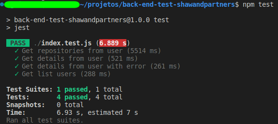
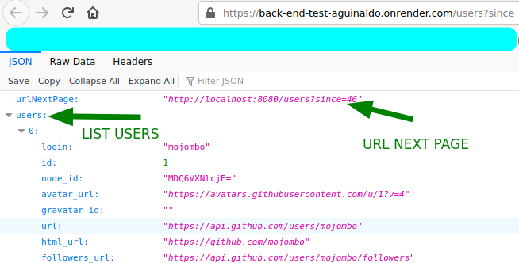

# Test Back-End for ShawAndPartners
## Made with NodeJS version v16.14.2


## ☕ 🚀 Install back-end-test-shawandpartners
```
cd root folder
npm install
```
## ☕ Run back-end-test-shawandpartners
```
npm start
or
node index.js
```
## 💻 Test back-end-test-shawandpartners
```
npm test
```


## 💻 End points availables
```
http://localhost:8080/users?since
http://localhost:8080/users/{username}/details
http://localhost:8080/users/{username}/repos
```

